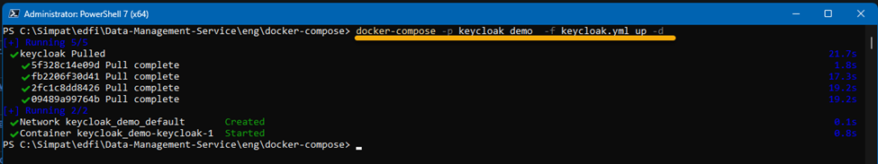
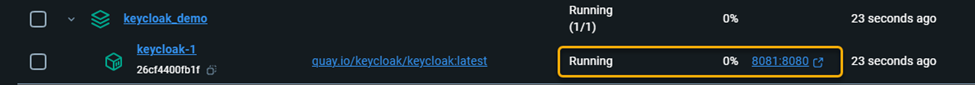
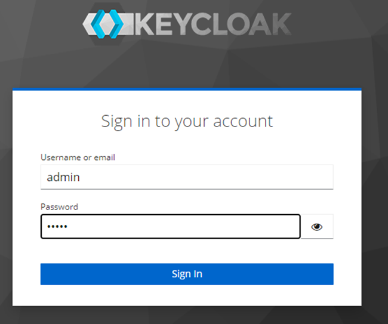
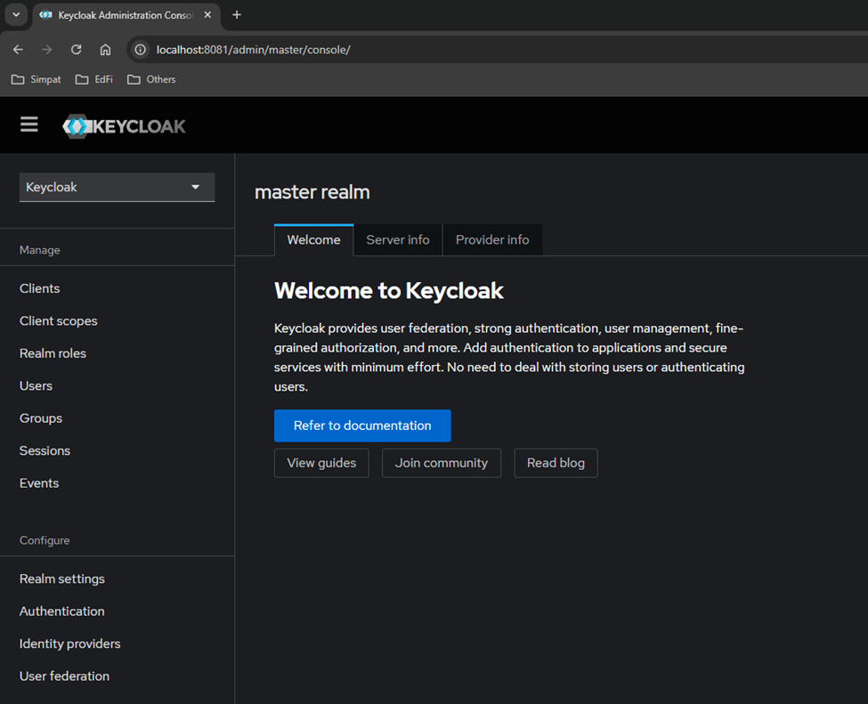
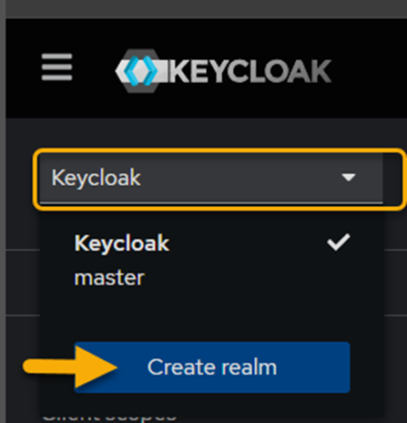
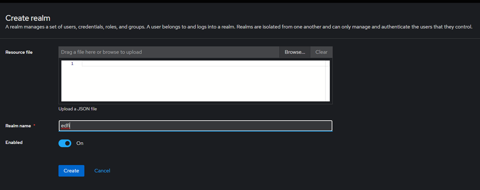
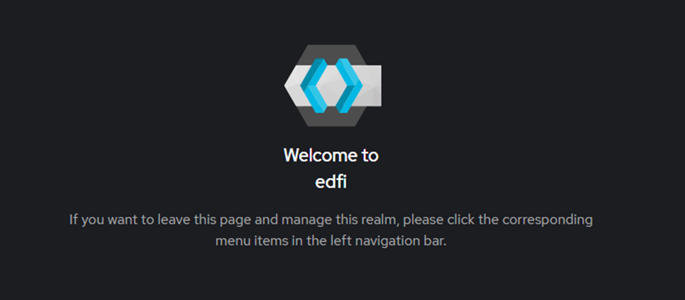
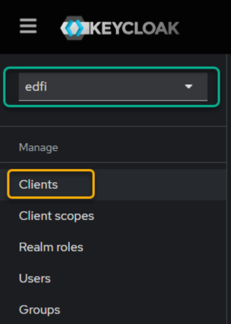
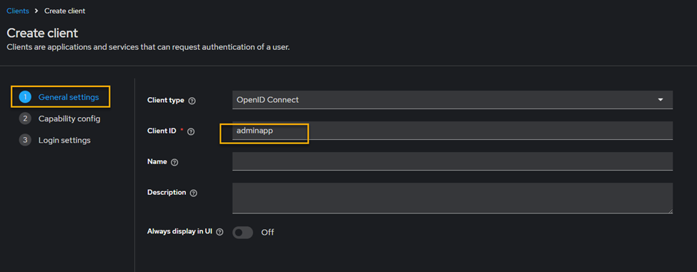
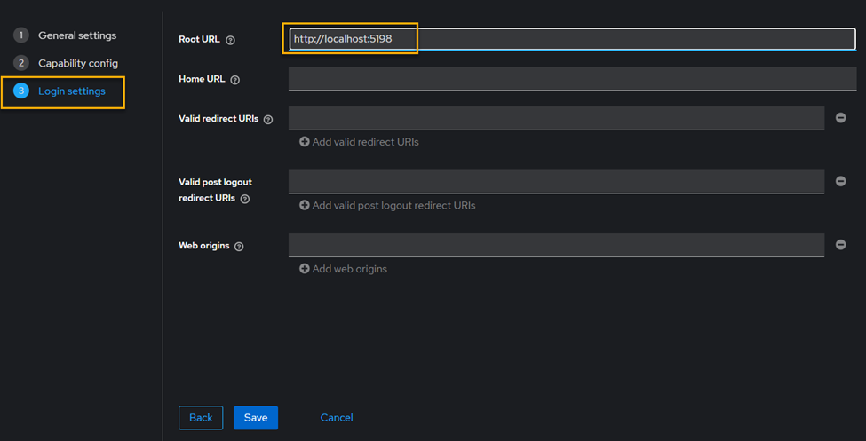

# Keycloak developer setup

The purpose of this document is to provide the basic steps for configuring Keycloak locally using docker-compose.

### 1.	A yaml file "keycloak.yml" (eng\docker-compose\keycloak.yml) was created that contains the configuration needed to lift the container using the command:
`docker compose -p keycloak_demo -f keycloak.yml up -d`

 

### 2.	Once either of the two previous commands is executed, you can validate that keycloak is up and running in Docker Desktop.
  

### 3.	Now, you can enter the URL: http://localhost:8081/

### 4.	On this page, you will be asked for your username (admin) and password (admin)

### 5.	Once authenticated, you will enter the settings.

### 6.	In the upper left of the scream, you must create a new realm, called “edfi”.

### 7.	In this configuration, we will only be asked for the name and click on Create

## 8.	The home screen will change this way

### 9.	We will proceed to the configuration of the client by clicking Clients, which is located in the left panel (Note: make sure you are in edit and not in Master).

## #10.	In General settings, we will assign a Client ID

### 11.	En Capability config, we will enable 
a.	Client authentication
b.	Authorization
c.	Authentication Flow, check-in Standard flow

### 12.	In Login settings, we will indicate the Root URL

### 13.	Click Save
 
